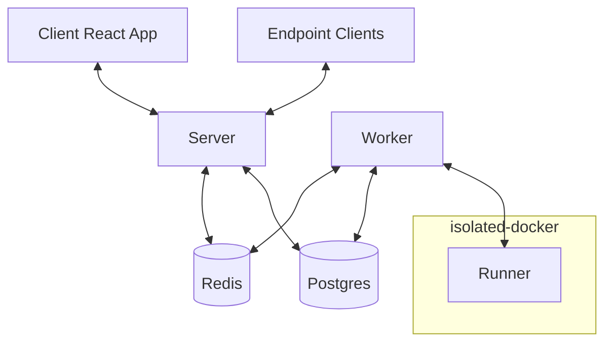
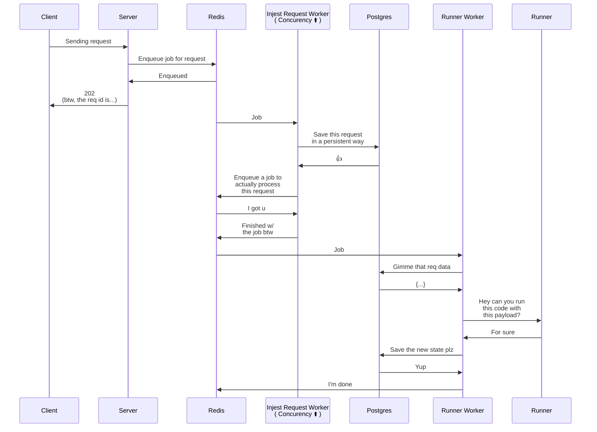
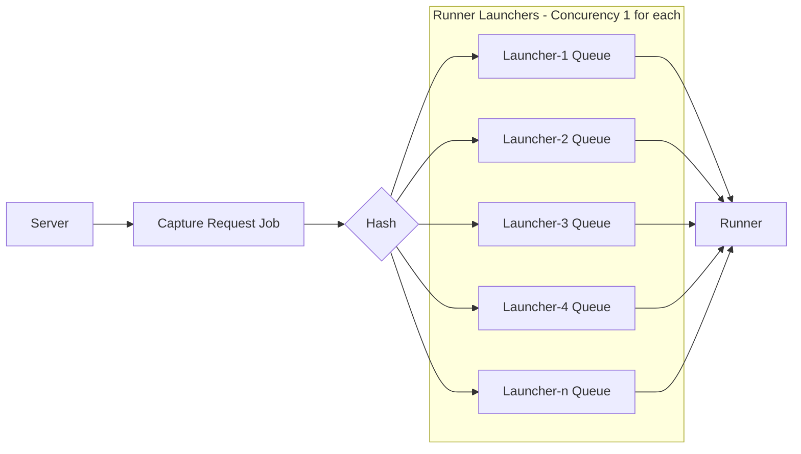

<style>
  .mermaid {
    /* position: absolute; */
    margin: 6em 0!important;
    top: 10%;
    left: 10%;
    background: rgba(0,0,0,0.02)!important;
    border: 2px solid #ccc;
    transform: scale(1.2);
    /* border: 1px solid blue; */
    }
</style>
Hello! It's been about a week since I first wrote about working on [~~Hook~~Web Reducer](/posts/hook-reducer). I'm on vacation from work and have some time to invest in this, and a lot has changed. I'm getting closer and closer to shipping an MVP. That's the next milestone. The vision is also sharpening.

## Business updates

### Name change

Something about HookReducer wasn't sitting quite right with me. I _loved_ that I got the .com, and what I'm building is well suited to webhooks. But it's not _just_ for webhooks. It's really for any kind of message. Initially, I'm only accepting messages via HTTP (and it could stay that way forever). But the client doesn't _have_ to be a webhook provider.

[**WebReducer.dev**](https://webreducer.dev) struck me as a better name. It's still easy to spell and say. I think it's memorable. The .dev TLD is generally less desirable than .com, but in this case, it immediately tells you that the product is a service for software development. HookReducer.com could be selling something to hang curtains, a sewing tool, etc, etc.

### Open source

I've decided to open source this project now, even though it's nowhere near feature-complete. I always intended to build an open product. I imagined features that would allow users to leave anytime they want, with their data and their code, and run on their own infrastructure. I was also leaning towards open sourcing everything. Once I made this decision to do it, I wondered when was the right time. I was a little bit fearful that someone would look at my code and judge me. Why did I use `x-library`? Why don't I use Y Design pattern there?

I've reflected a little bit and gotten over these fears

- Criticism can be very useful, so why not have it
- When it isn't useful, ignore it
- If I let these fears prevent me from open sourcing, I won't really be building in public, which was part of the whole point of this project. I believe building in public is partly about letting people see the process, not just a polished product.

So, I've made [the repo](https://github.com/zekenie/web-reducer) public as of now.

## Product

I've made some progress on value prop. I think I can articulate some use cases more clearly than I could last week. A point of emphasis: _this is a µ-product_. It's designed for µ-problems, of which there are many. Here are some I've thought of.

- Prototyping
  - Often times when you're working on a new project, it's somewhere between prototype and production application. Maybe you don't have as many tests as you normally would. Maybe you don't have as much observability as you might want. _Maybe you don't handle webhooks all that well_. Start with WebReducer. Put it in front of your project.
  - Maybe you have a new integration in your product. It's immature, and you're not sure if it'll stick around. They have a webhook feature, but you don't want to do the legwork to setup a queue, validate authenticity, etc, etc, etc. Put WR in front of your app. Write your reducer function later if you ever need it.
  - Your building a client-side prototype and don't want to bother with a real backend, but would love to save a little data somewhere. We've got you covered
- IOT
  - Do you have devices out in the world that are intermittently connected? Maybe you want them to be able to connect to a server and ask "what happened since I last had a connection." WR is perfect for that.
- Business observability
  - Perhaps there are business events you care about on a 3d party platform. These events matter to the business, but not to the software. It would take engineering resources to create webhook endpoints for them. You just want to stick them somewhere and do something with them later.
- Games
  - You want multiple players to agree on the state of the world
  - Multiple players can send in events
  - All players are notified via websocket when the state of the world changes
- Personal
  - I want to expose a read endpoint that tells my friends how many unread messages are in my gmail inbox using [the gmail api](https://developers.google.com/gmail/api/guides/push?utm_campaign=io15&utm_source=gadbc&utm_medium=blog)

## Engineering

On the engineering front, I've made the most progress. I've added many security measures for the code runner.

### High level architecture, security, and resilience

The system is designed with two priorities

1. Go down as little as possible
2. Don't let user-generated code do anything bad

To achieve this, I make heavy use of queueing and isolate the hell out of the VM that runs user-generated code. I took some inspiration from [Tim Nolet's post](https://www.freecodecamp.org/news/running-untrusted-javascript-as-a-saas-is-hard-this-is-how-i-tamed-the-demons-973870f76e1c/).



When requests hit WebReducer, they are put directly into a [bull](https://github.com/taskforcesh/bullmq) queue. The only thing that happens before that is body parsing. If we see a surge in traffic, the database won't be the point of failure. These enqueued jobs are processed with a reasonably high concurrency. The initial processing doesn't run the code, it just captures the request in postgres and enqueues the next job to run the code.



The launcher queue has a concurrency of 1. It's very important that two launchers are not run at the same time because they would run into a race condition. Whoever saves the state last would win. You might note that a concurrency of 1 is not scalable. To solve this, I've created a series of _N_ launcher queues. When a job is enqueued, it is assigned to one of them by a hash of endpoint key. _Individual_ endpoints process requests serially, but the system processes requests in parallel.

The runner itself is stateless. I can create as many instances as I want if it ever becomes the bottleneck.



### Recomputing state

One of the best features of WebReducer is going to be recomputing your state when you change the code. But, if you've received 1M events, it doesn't make sense to enqueue 1M jobs in the queue and hit the runner 1M times. I've built the system to be capable of batching requests. This could come in handy at some point for high-volume endpoints, but for now, I'm only conceiving of it for replaying state.

- [bulk update service](https://github.com/zekenie/web-reducer/blob/aeee0b4928b334f84b595971e3eaa36ac1787556/server/src/runner/bulk-runner.service.ts)

### UI

#### Sticky date line

I realized that in my initial design prototype, there was a whole column in the requests table that was often displaying the exact same data:


So I added a line in the table representing the date change. [Here's how I made the date line](https://github.com/zekenie/web-reducer/commit/b51087b5da7af19465cca15dcf901cbca4d35402). Whoever thought of `position: sticky` deserves a medal.


<!-- https://twitter.com/_off_by_one/status/1473421970985431042 -->

#### Modals

I realized that modals are going to be an important UI element, so I setup a system I'm pretty happy with.


When you want to open an existing component in a react component, here's how you would do that

```tsx
const YourButton = () => {
  const { openModal } = useModals();

  const openFooModal = useCallback(
    (fooName: string) => {
      openModal({
        name: "foo",
        props: { fooName },
      });
    },
    [openModal]
  );

  return <Button onClick={openModal}>Open Foo Modal</Button>;
};
```

To create a new modal:

```tsx
import { registerModal } from "../modals/ModalProvider";
import {
  CenteredModalContainer,
  ModalBody,
  ModalFooter,
  ModalHeader,
} from "../modals/Content";

type MODAL_NAME = "test";
const MODAL_NAME: MODAL_NAME = "test";

declare global {
  namespace Modal {
    interface ModalTypes {
      [MODAL_NAME]: {
        name: MODAL_NAME;
        props: Props;
      };
    }
  }
}

type Props = { text: string };

const TestModal = ({ text }: Props) => {
  return (
    <CenteredModalContainer>
      <ModalHeader title="Are you sure you really want to" />
      <ModalBody>foobar! {text}</ModalBody>
      <ModalFooter>Footer goes here</ModalFooter>
    </CenteredModalContainer>
  );
};

registerModal<MODAL_NAME>(MODAL_NAME, TestModal);
```

Features of this system:

- Typed in modal definition and in `openModal`
- Modals are a global concern like URL navigation, so it's good to have them at the top of the application
- Modals are at the top of the tree, not sprinkled everywhere
- Modals can be launched from anywhere in the tree

Commits:

- [Initial modal type system](https://github.com/zekenie/web-reducer/commit/d17f7bdd59c9b70dcf943dc696a6252b09337221#diff-8114314fe68ab7b031b5b38d95e9d9f06f4a897a3f17972a370427e7becbf6a7)
- [Modal styling](https://github.com/zekenie/web-reducer/commit/d17f7bdd59c9b70dcf943dc696a6252b09337221#diff-8114314fe68ab7b031b5b38d95e9d9f06f4a897a3f17972a370427e7becbf6a7)
- [Hygen template for modals](https://github.com/zekenie/web-reducer/commit/6807e51b8c0788dab041c40bd8610aed39aa1045)
