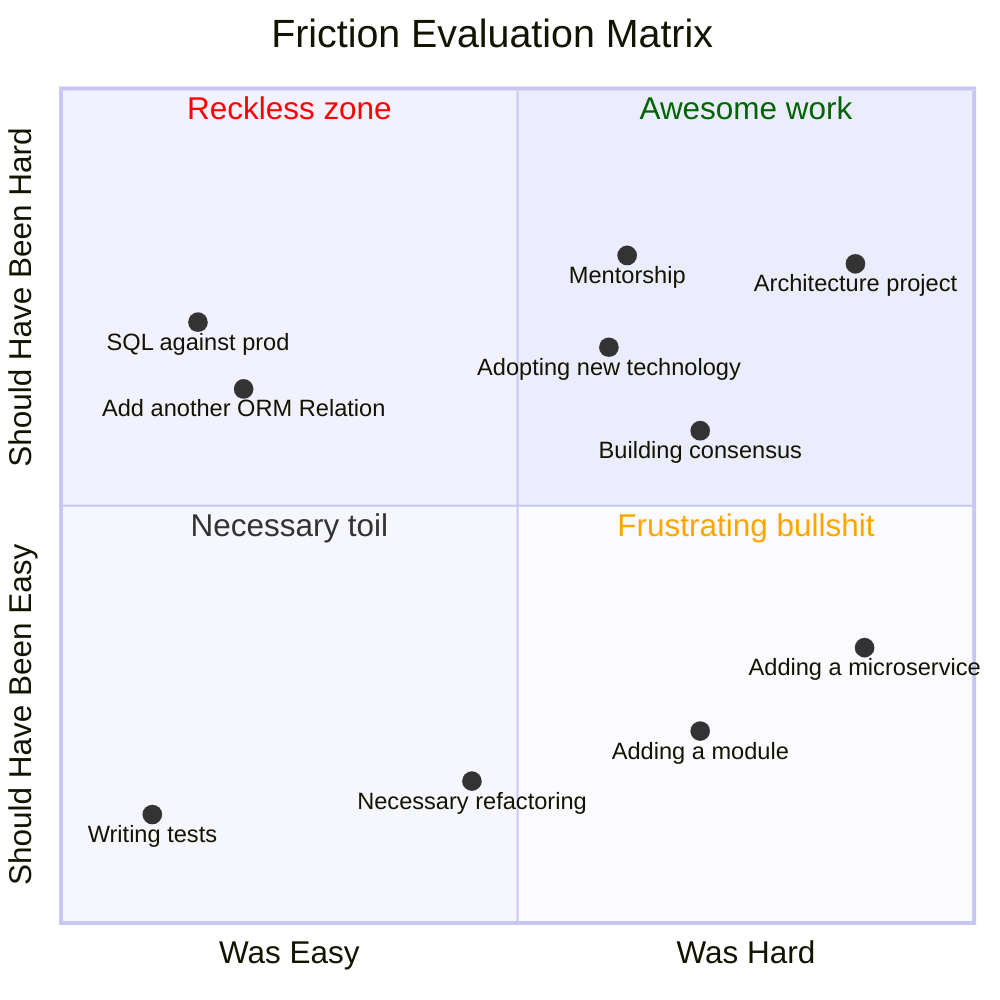
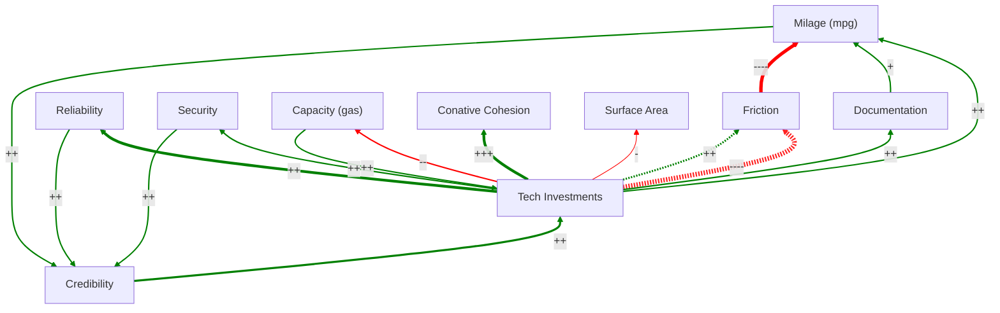
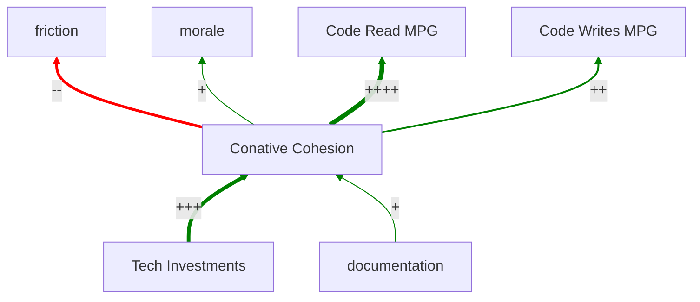
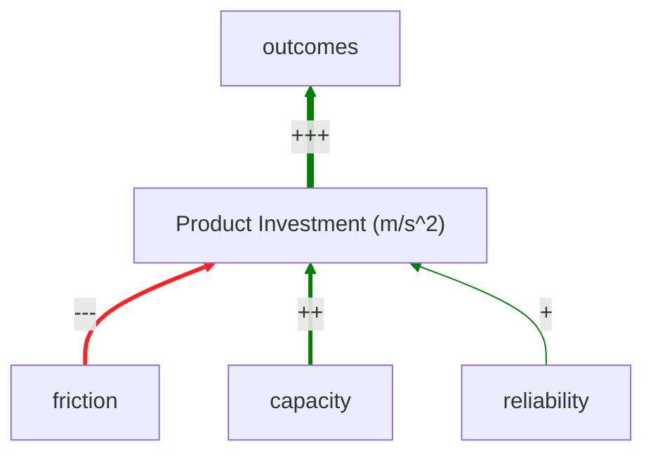

I have a process for making a codebase better over time, and it's so simple it could almost be a tweet:

**Make stuff that should be easy easy. Make stuff that should be hard hard.**

If my brain had telemetry, I think the CPU load while at work would look something like this. Noisy and spiky.

    
    

The spikes are part of what people call "friction" at work. Friction isn't _always_ bad, but usually it is. There are a handful of things that you actually want to require extra effort to do. But as a rule it's something we are constantly trying to minimize.

My process starts by doing product engineering. Every time I pick something up, be it exciting or mundane, I take telemetry. When something seems really hard, I bookmark it.

Periodically, I reflect on what's been hard. Here are some made up examples

  <svg xmlns="http://www.w3.org/2000/svg" fill="none" viewBox="0 0 24 24" stroke-width="1.5" stroke="currentColor" class="w-6 h-6 transform translate-y-3.5">
    <path stroke-linecap="round" stroke-linejoin="round" d="M12 9v3.75m-9.303 3.376c-.866 1.5.217 3.374 1.948 3.374h14.71c1.73 0 2.813-1.874 1.948-3.374L13.949 3.378c-.866-1.5-3.032-1.5-3.898 0L2.697 16.126ZM12 15.75h.007v.008H12v-.008Z" />
  </svg>

  

    
Both axes are subjective

  
But, the X-Axis is a qualitative measurement of your experience–what was and was not hard. The Y-Axis is more subjective. It's your opinion about what should be.

  

Later, when I'm doing self-driven work, I try to react to my observations.

## Address The Reckless Zone

If I observe something in The Reckless Zone, it's important to address quickly. For example, if engineers at a small but growing startup are running queries against the main production DB, that's something that needs to be addressed because it could take down the system.

To mitigate observations in The Reckless Zone, we need to _add_ friction. It's important that the friction is automated. I'm talking about linters, PR bots, Slack alerts, etc. We should minimize the extent to which someone needs to _enforce_ stuff.

## Celebrate awesome work

It's important for ICs' work to be _visible_ and celebrated. When folks do good, hard things, the broader team needs to know. Different companies have different mechanisms of this, but usually there's at least a slack channel for celebrating wins. If not, maybe there should be.

## Work on Frustrating Bullshit

Whenever you encounter something that is hard but should be easy, it's important to take a careful look at it. This could be a golden opportunity to improve the broader tech org.

Not everything is easily addressable. Some problems are not technical ones. But this is the quadrant that's holding you back. You need to build a culture that chips away at this unnecessary friction over time, and periodically makes investments that produce big leaps forward.

When teams are "too busy" to make investments in working better, that means they'll be just as "busy" next year. They probably feel chronically overworked and frustrated. Imagining shoveling a huge pile of dirt with a spoon and thinking "there's gotta be a better way," only to be told "nope, don't think about that! too much dirt!"

## The org is a dynamic system

Different people in the organization will have different perspectives on what needs to be hard and what doesn't. It's a big dynamic system. It's hard work to build enough consensus, but it's worth it. When you achieve a well-calibrated friction space, goals are more likely to get met, people are happier, and the company starts to trust that the engineering organization can do what it says.

    

Let's take a minute to zoom in on a subgraph here...

### Tech Investments

Tech investments take away capacity you could spend elsewhere. These investments add _and_ remove friction, but they take away more than they add. They enhance security, reliability, and conative cohesion. Tech investments (in contrast to product investments), tend to modestly remove surface area (a liability). Tech investments empty your gas tank, but increase your milage.

In order to do tech investments, you need some credibility in the org, but by doing tech investments well, you tend to build credibility, as well.

### Cognitive cohesion

Conative cohesion is a mostly squishy idea that things that belong together are found together. At work, we try to measure this by seeing how many modules need to be modified in a single chunk of work. If for most tasks you can open up a single module, load it into your brain, and ignore the rest of the application, that's a proxy for high cognitive cohesion.

Another way to get a feel for cognitive cohesion: how many people have to be involved to make a seemingly simple change happen? Is it a couple people on a team, or 4 teams coordinating via weekly "scrum of scrum" meetings? At prior company, creating a new promotional discount took a quarter and required constant syncing of more teams than I'd care to admit. That was because the details of discounts were spread out into a web of tiny, brittle micro-services that had **low cognitive cohesion**.

## Velocity

It's tempting to think of product investment and tech investment as zero-sum. An hour spent on one is an hour not spent on the other. But friction (in the wrong places) has a profound drag on product velocity.

On the other side of the coin, it's not really possible for engineers to achieve business outcomes with tech investments alone.

## Changing friction space

The real task of senior-level ICs is to continuously (and strategically) mold the friction space in response to the needs of the business. The reason why this is continuous is because the needs of the business are in constant flux. A well-calibrated friction space for a scrappy 10 person engineering organization will be totally dysfunctional for a 20 or 200 person org.

I'm not a big fan of dedicated teams that are charged with reducing friction. It can be the right move, but these teams tend to lose touch with the reality of the friction space and work off of their mental model of the friction space which drifts away from reality. Instead I'm in favor of empowering every engineer to work on the friction space. If there is a dedicated team, it's important for them to have good feedback mechanisms. This could take the shape of pair programming with "product engineering" or rotating onto teams for a quarter per year.

If you're company hasn't learned how to manage it's friction space yet, work on it. Things will only get more painful until you figure out how to manage friction as part of development.

