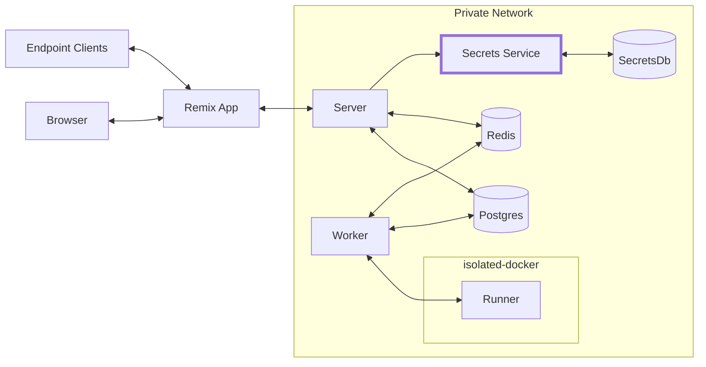

It's been a little while since my [last update](https://offbyone.us/posts/micro-business-update/) on WebReducer. Let's just say I've had [a lot going on](https://offbyone.us/posts/baby-household-supply-chain/) 😅.

Progress on WebReducer has continued in fits and starts none the less. I've been shockingly productive given how little time I've spent at the keyboard. During parental leave, I've treated this side project like many people would treat reading a book. When I have a few minutes, I pop it open. Reliably I get 30 minutes, twice a week while I'm getting allergy shots. I also find 5m - 1h here and there at all hours of the day and night.

But, there are many unstructured hours every day for my mind to wander. My hands are tied up, but I can think about anything. Sometimes I think about my son, sometimes I think about something that has to get done around the house, and sometimes I think about WebReducer.

This has had a pretty interesting effect on the work. I'm much, much more deliberate. Instead of messing around and trying things, by the time I get to the keyboard, I know exactly what I want to do. I've already considered 3 different approaches, and I've made my preliminary decision. Of course, there are changes I make once I see how things play out, but I generally have a pretty good sense of my system design by the time I try to build it. That's not to say I have a formal plan, in fact, nothing could be farther from the truth, just a slow-cooked mental model of the direction I'm going.

## So, what has happened?

### First-time UX

When you first open up a WebReducer, you should be able to get up and running _fast_. Like in a click or two. I built this snazzy little empty-state that lets you configure your first request to the endpoint and copy it to your clipboard in a single click. Here's a janky demo of that working locally.

<iframe src="https://www.youtube.com/embed/pjBO7wkZNCA" title="YouTube video player" frameborder="0" allow="accelerometer; autoplay; clipboard-write; encrypted-media; gyroscope; picture-in-picture" allowfullscreen></iframe>

I like this interface because it gets you into the product without even writing a line of code. I imagine that after you make your first request and see it appear, you'll somehow be prompted to write some code, perhaps by a cursor starting to write some for you... TBD.

### Authentication

One of the most important things about WebReducer is that you can use it without an account. When someone goes to webreducer.dev, they already have an endpoint that they can ` $ curl`. This endpoint is ephemeral, and to keep it, you need to sign up.

It is also important that I don't store passwords. I think passwords are a barrier to entry and a security risk. I want magic link authentication. Eventually there can be a 2FA option (which could be a password, authentication app, etc). For the MVP I don't think this is necessary.

There are 2 parts of WebReducer authentication: _sign-in tokens_ and _credentials_.

Credentials are given to all users–authenticated or otherwise. The second you hit the app, you have a guest account that's not associated with any email address. Once you sign up, we send over a sign-in token to your email address. When you go to the URL we send, we consider to be a "real" user. Sign-in tokens exist to prove you control an email address.

Credentials are made up of a short-lasting _JSON web token_ and a long lasting _refresh token_. Both are sent along with every request you make. JWTs can be validated statelessly by multiple independent micro-services, and since the app is relatively chatty this has certain advantages. We don't need to do a db hit on every request or do any kind of shared session state. But, when the JWT expires, the refresh token is [used](https://github.com/zekenie/web-reducer/blob/16ca0873c6c380d761178bbc82b2858cb9df83ac/server/src/auth/auth.service.ts#L53) to issue a new JWT/refresh token pair. The refresh token is stateful–it exists in the database. Refresh tokens can only be used once.

To sum up:

- You can use the app without signing up
- Once you sign up, you never need a password
- You don't get logged out all the time
- I can spin up microservices that can use this auth scheme without holding centralized state

### Secrets 🤫

I realized that many, many webhook endpoints don't work without stored secrets. Often, webhook providers want to you validate the authenticity of a message using [hash-based message authentication code](https://en.wikipedia.org/wiki/HMAC) (HMAC). HMAC requires you to have a secret in your possession that was given to you by the provider. It'd be terrible for me to require users to just keep that secret in plain text in their code. I don't plan on having my database breached, but if I did, I'd want it to be harder than that to access this kind of secret.

I decided to build a separate microservice in charge of secrets.

The organizing principal behind this decision is that if any single part of the system is breached, secrets are not compromised.

Secrets are organized in namespaces. A namespace is simply a collection of secrets with an access key. There is no way to list access keys, the Secret Service doesn't even have them, it just stores a hash digest. When a WebReducer is made, there is a namespace created, and the access key is stored encrypted in the monolith. If the monolith db is breached, an attacker would also need an encryption secret which is stored in an environment variable.

If the secret database itself was breached, it would be hard for an attacker to exploit. Every key value pair is encrypted with a per-namespace key, and these keys are encrypted with a key that's stored in an environment variable.

I'm working on automatic key rotation for all these systems, but it's not there yet.

I'm _sure_ there are flaws in this system. I'm not trying to launch this product with enterprise-grade security. I'm trying to not be irresponsible as I learn if this product has legs. I think if people start using it, it'll get better. It's open source. There will eventually be a bug bounty program. If this product is meant to be, security will come. Customers will be warned.

### New ideas

Here's an incomplete list of feature ideas. Some of these I may get to, some I may not. Some are distractions.

- **Side effects**. WebReducer code is synchronous and functionally pure. With the same input, and the same code, you get the same output. There is currently no communication with any outside system. A side effects feature would allow users to trigger requests to other systems _after_ the reducer runs. Unlike the reducer, side effect code would not re-run with code changes. Side effects could be an email you conditionally send to yourself when the state changes in a certain way, an http request you send to a slack endpoint to notify a channel, etc.
- **State branches**. You should be able to have a single WebReducer control different versions of your state. You could map different write keys to different state branches
- **Scheduled requests**. What if you could set up a cron to hit your own WebReducer. Could be very useful for some applications
- **Queryable views**. The original WebReducer concept had `readKeys` and `writeKeys` These were effectively revokable endpoints that could read and write state. `writeKeys` couldn't mutate state directly, instead state changes were mediated by the `reducer` that users wrote. I realized that it could be great to have the read behavior also be configurable. Perhaps there's a `readState` function that is called on every `readKey` request.

## Demo ideas

I really need to focus and get this product into the world. I'm prone to distractions. One source of focus for me has been thinking about demos. When I consider what I will build with this product, it helps me understand what features are essential and what's cruft. Here are a list of demos I'm itching to make. I think I'll live code them once I get a version of this product out there.

- **Card games**. I could build realtime, multiuser card games like blackjack.
- **Simple form submission**. One of the coolest applications of WebReducer is a form submission. You can point an HTML form at your endpoint and submit a form. With a `responder` function, you can `301 redirect` users back to your site or render an HTML thank you page. I love this demo because it's really really easy and practical.
- **Interactive blog post**. In a blog post like this, there could be little buttons next to ideas like `(neat!)` that users could click to tell me they dig something
- **Personal dashboard**. This was kind of [the idea that got WebReducer going in the first place](https://twitter.com/_off_by_one/status/1457460794631892994). I wanted a public URL in my email signature that would answer the question "how's it going..." I wanted to show my internet speed, sleep quality, etc. Recently I thought it'd be cool to show % of uncalendared time, # of unread emails, etc. This is a very webhook-heavy application, it doesn't require a relational database, and is perfect for WebReducer.
- **Dynamic consultant pricing**. I'm not a consultant, so that makes this somewhat theoretical. But, if you wanted to book an hour of my time, perhaps there could be an algo aware of my calendar, inbox status, mood, etc.
- **Bloom filter**. I realized that I could write a hacky little bloom filter [like this](https://dev.to/abhinpai/bloom-filter-in-javascript-1efe). This is obviously a weird use case, but it's just kind of cool that it's possible. There are probably cousins of this idea that are cooler.

Any ideas for me? Want to be a beta tester? [Give me your email](https://webreducer.dev)
