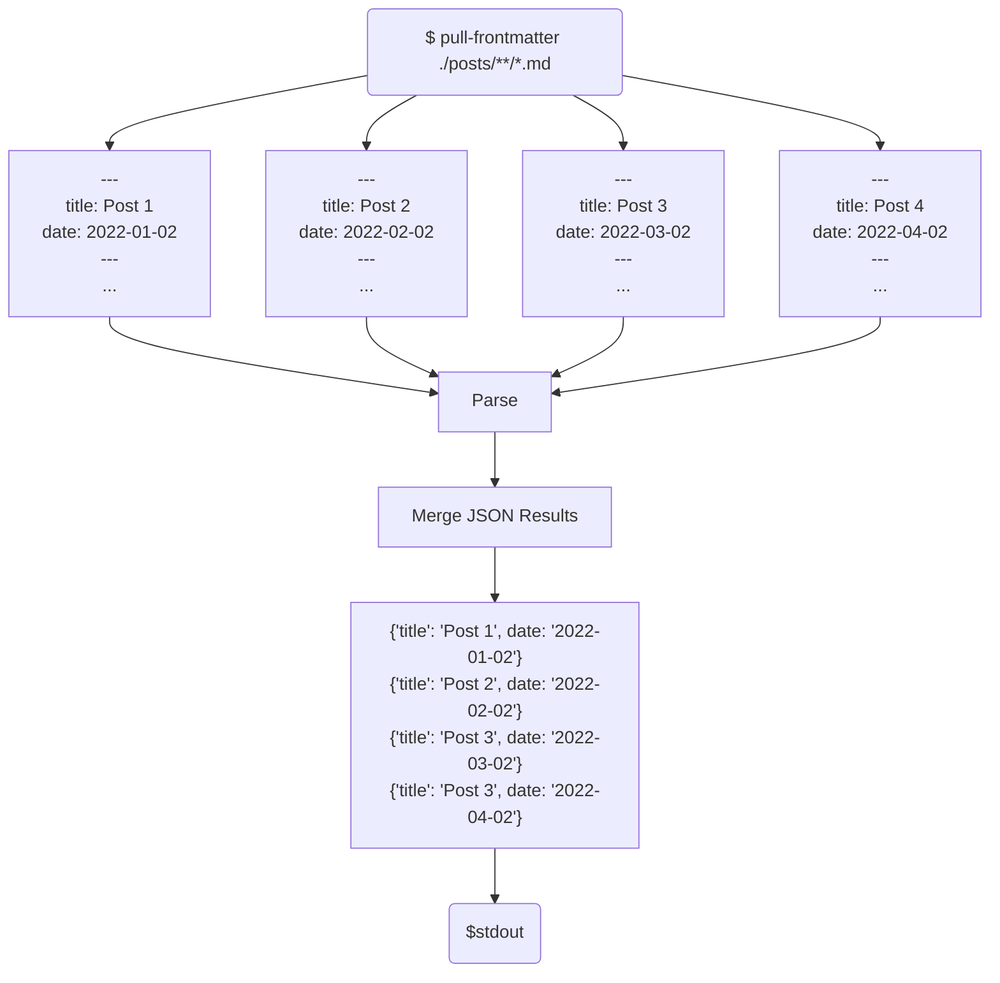

# `pull-frontmatter`



The `pull-frontmatter` command line tool extracts YAML front matter from Markdown files and outputs the collected data as JSON. This tool is designed to streamline workflows that involve processing and analyzing metadata from Markdown documents.

## Installation

To install `pull-frontmatter`, you'll need Node.js and npm installed on your computer. Once those prerequisites are met, you can install `pull-frontmatter` globally using the following command:

```zsh
# From this directory
npm install -g .
```

This command will install `pull-frontmatter` globally so that it can be run from any directory on your system.

## Usage

To use `pull-frontmatter`, navigate to the directory containing your Markdown files and run:

```zsh
$ pull-frontmatter ./blog/**/*.md > blog-metadata.json
```

This command will process all Markdown files in the current directory, extracting the YAML front matter and outputting it as JSON, then send it to a json file.

It also accepts piped input.

```zsh
$ find ./posts -name "*.md" | pull-frontmatter
```


## Limitations

- This script is not designed for extrmely large datasets. It does not stream output.
- That said you can pipe things into it, and it will fetch them concurrently
- I just decided I'd rather have the output be valid JSON then line deliminiated json, so that has some implications about the upper bound. All the frontmatter needs to fit in Node.js memory

